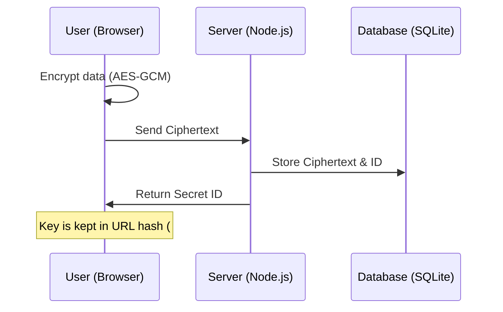

# 🛡️ SecureShare - Security Architecture


SecureShare is a high-security, zero-knowledge platform for sharing sensitive information. It is designed with a "Privacy by Design" approach, ensuring that even the server hosting the data cannot access the content.

## 🔐 Core Security Principles

### 1. End-to-End Encryption (E2EE)
All encryption and decryption happen exclusively in the user's browser.
- **Algorithm**: AES-256-GCM (Authenticated Encryption).
- **Key Storage**: The unique decryption key is generated on the client and stored in the URL fragment (the part after the `#`). 
- **Zero-Knowledge**: Per W3C standards, the URL fragment is **never sent to the server**. Our infrastructure only sees the encrypted blob, never the key.

### 2. Strong Key Derivation (KDF)
When an optional access password is set, we don't use it directly as a key.
- **Mechanism**: PBKDF2 (Password-Based Key Derivation Function 2).
- **Parameters**: 100,000 iterations with SHA-256.
- **Salt**: Every secret has a unique, cryptographically secure random salt generated on the client.

### 3. Brute-Force Protection (Burn-on-Fail)
To prevent automated guessing of access passwords:
- **Limit**: A secret is **permanently deleted** from the database after 3 failed password attempts.
- **Rate Limiting**: Strict IP-based and global rate limits are enforced on all API endpoints.

### 4. Hardened Infrastructure
- **CSP with Nonce**: A strict Content Security Policy prevents Cross-Site Scripting (XSS). We use unique nonces for every request, disabling `unsafe-inline` and `unsafe-eval`.
- **HSTS**: HTTP Strict Transport Security ensures all connections are forced over HTTPS.
- **Permissions Policy**: Disables all unnecessary browser features (camera, microphone, geolocation) to reduce the attack surface.
- **Opaque Errors**: The API returns identical 404 errors for non-existent, expired, or already burned secrets to prevent ID enumeration.

## 🔄 How it Works

The security of SecureShare relies on the fact that the server is never aware of the decryption key.



## 🛡️ Threat Model
For a detailed analysis of security assumptions and mitigations, see [THREAT_MODEL.md](./THREAT_MODEL.md).

## 🚀 Deployment
For detailed instructions on deploying to GCP, Azure, VPS, or using Docker with HTTPS, see the [Deployment Guide](./DEPLOYMENT.md).

**IMPORTANT**: Before deploying, read the [Security Limitations](./LIMITATIONS.md) and [Threat Model](./THREAT_MODEL.md) to understand what this app protects against and what it does not.

### Quick Docker Start (Local)
```bash
# Build the image
docker build -t secureshare .

# Run the container (maps port 3000 and persists data to ./data)
docker run -d -p 3000:3000 -v $(pwd)/data:/app/data secureshare
```

## 🧪 Development & Testing
```bash
# Install dependencies
npm install

# Start development server (Express + Vite)
npm run dev

# Run unit and integration tests
npm test

# Lint the codebase
npm run lint
```

## 🛡️ Security Features
-   **AES-256-GCM Encryption**: Authenticated encryption using Web Crypto API.
-   **Atomic Transactions**: Prevents race conditions during secret destruction.
-   **Zero-Knowledge**: Server never sees the decryption key.
-   **Rate Limiting**: Protects against brute-force and DoS.

## 🛠️ Technology Stack
- **Frontend**: React 19, Tailwind CSS 4, Motion.
- **Backend**: Node.js (Express) with `helmet` and `express-rate-limit`.
- **Database**: SQLite with indexed TTL (Time-To-Live) for high-performance automated cleanup.
- **Encryption**: Web Crypto API (AES-256-GCM, PBKDF2, SHA-256).

## 📋 Compliance & Standards
- **RFC 9116**: `security.txt` is implemented at `/.well-known/security.txt`.
- **Opaque Errors**: Prevents enumeration attacks.

## ⚙️ Technical Limits
- **Secret Size**: Maximum 1MB of encrypted data per secret.
- **View Limit**: Maximum 10 views per secret.
- **Expiration**: Maximum 7 days (168 hours).
