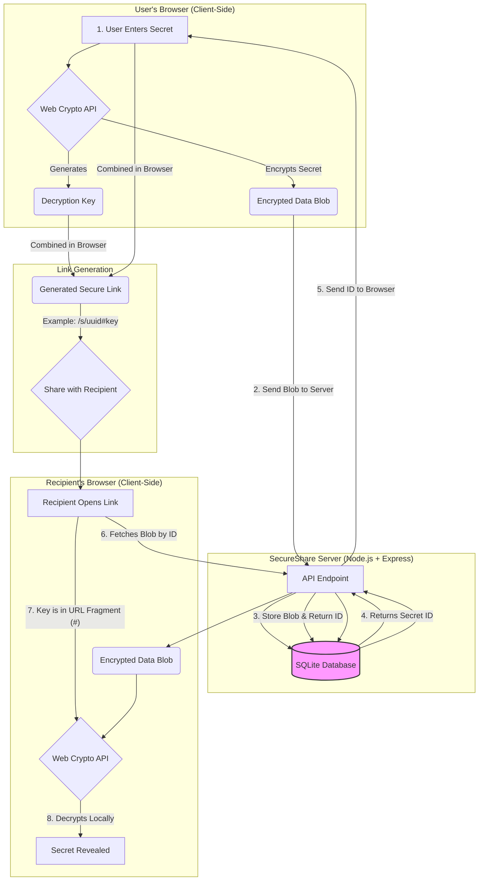

# 🛡️ SecureShare: Share Secrets Securely

**A simple way to send sensitive information with end-to-end encryption. What you share is for the recipient's eyes only.**


## What is SecureShare?

Have you ever needed to send a password, API key, or private note and felt uneasy doing it over email or chat? SecureShare solves this problem.

It's a simple tool that lets you create a **secure, one-time link** for your sensitive data. The link automatically expires after the first access or after a set time, ensuring your information doesn't stay on the internet forever.

### Key Features (in simple terms):

-   **🔒 The Client-Side Advantage (Zero-Knowledge)**: Unlike many other "secure" sharing tools that encrypt data on their servers, SecureShare performs all encryption **locally in your browser**. We never see your plaintext data, and we never see your decryption keys.
-   **🔥 Self-Destructing Links**: Links are automatically deleted from the server after they are used or expire.
-   **🛡️ Anti-Spam Protection**: Built-in Proof of Work (Hashcash) prevents automated bots from flooding the service.
-   **🔑 Password Protection**: Add an extra layer of security with a password (also hashed locally).
-   **📱 Easy Mobile Sharing**: Generate a QR code to securely transfer the link to your mobile device.

---

## For the Technically Curious: Security Architecture

SecureShare is a high-security, zero-knowledge platform for sharing sensitive information. It is designed with a "Privacy by Design" approach, ensuring that even the server hosting the data cannot access the content.

### 🔐 Core Security Principles

#### 1. End-to-End Encryption (E2EE) & Zero-Knowledge
All encryption and decryption happen exclusively in the user's browser.
- **Algorithm**: AES-256-GCM (Authenticated Encryption with Associated Data).
- **Key Storage**: The unique decryption key is generated on the client and stored in the URL fragment (the part after the `#`). 
- **Zero-Knowledge**: Per W3C standards, the URL fragment is **never sent to the server**. Our infrastructure only sees the encrypted blob, never the key.

#### 2. Advanced Anti-DoS & Anti-Spam (Proof of Work)
To ensure high availability and prevent automated abuse, SecureShare implements a robust, cryptographic Proof of Work (PoW) system.
- **Hashcash Implementation**: Every secret creation request requires the client to solve a computationally expensive SHA-256 challenge.
- **Dynamic Difficulty**: The challenge difficulty is dynamically adjusted by the server.
- **Replay Protection**: A server-side SQLite nonce tracking system guarantees that a PoW solution can only be used exactly once.
- **Strict Expiry**: Challenges are cryptographically salted with a timestamp and expire strictly after 10 minutes, preventing pre-computation attacks.
- **API Exemption**: Programmatic access via valid API keys bypasses PoW, ensuring seamless automation for trusted systems.

#### 3. Strong Key Derivation (KDF)
When an optional access password is set, we don't use it directly as a key.
- **Mechanism**: PBKDF2 with 100,000 iterations and SHA-256.
- **Salt**: Every secret has a unique, cryptographically secure random salt generated on the client.

#### 4. Brute-Force Protection & Auto-Destruction
To prevent automated guessing and unauthorized access:
- **Auto-Destruction**: A secret is **permanently deleted** from the database after 3 failed password attempts.
- **Rate Limiting**: Strict IP-based and global rate limits are enforced on all API endpoints.
- **Atomic Transactions**: Database reads and deletions are wrapped in strict `IMMEDIATE` SQLite transactions, completely eliminating race conditions (e.g., two people clicking a one-time link simultaneously).

### 🏛️ Architecture

The application is designed with a security-first, zero-knowledge architecture.



## 🚀 Deployment
For detailed instructions on deploying to GCP, Azure, VPS, or using Docker with HTTPS, see the [Deployment Guide](./DEPLOYMENT.md).

**IMPORTANT**: Before deploying, read the [Security Limitations](./LIMITATIONS.md) and [Threat Model](./THREAT_MODEL.md) to understand what this app protects against and what it does not.

### Quick Docker Start (Local)

The recommended way to run SecureShare on **any system** is using **Docker Compose**:

```bash
# Start the application (Universal for Linux, macOS, and Windows)
docker compose up -d
```

> **Tip**: Docker will automatically create a `data` folder in your current directory to store the encrypted database.

#### Manual Docker Commands

If you prefer to use standard Docker commands, first build the image:

```bash
docker build -t secureshare .
```

Then run the container using the command for your specific system:

| System / Shell | Command |
| :--- | :--- |
| **Linux / macOS / Git Bash** | `docker run -d -p 3000:3000 -v $(pwd)/data:/app/data secureshare` |
| **Windows (PowerShell)** | `docker run -d -p 3000:3000 -v "${PWD}/data:/app/data" secureshare` |
| **Windows (Command Prompt)** | `docker run -d -p 3000:3000 -v "%cd%/data:/app/data" secureshare` |

## 🧪 Development & Testing
```bash
# Install dependencies
npm install

# Start development server (Express + Vite)
npm run dev

# Run unit and integration tests
npm test

# Lint the codebase
npm run lint
```

## 💡 Choosing Your Interface: GUI, CLI, or API?

SecureShare offers three ways to interact with the system, each designed for different needs.

| Interface | Best For... | Use Case Example |
| :--- | :--- | :--- |
| **🌐 GUI (Web App)** | **Manual, one-off sharing.** Ideal for all users, including non-technical ones. | Quickly sending a password to a colleague. |
| **💻 CLI (Command Line)** | **Developers & Admins.** Perfect for scripting and terminal-based workflows. | A bash script that generates a temporary key and shares it. |

---

## 🛡️ Security Features Overview
-   **AES-256-GCM Encryption**: Authenticated encryption using the native Web Crypto API.
-   **Cryptographic Proof of Work (PoW)**: Hashcash-style Anti-DoS protection with replay prevention and strict TTL.
-   **Atomic Transactions**: Prevents race conditions during secret destruction using SQLite `IMMEDIATE` locks.
-   **Zero-Knowledge Architecture**: The server never sees the decryption key or plaintext data.
-   **Hardened Session Management**: Strict CSRF protection, secure cookie attributes (`httpOnly`, `Secure`, `SameSite=Strict`), and explicit server-side logout.

## 🛡️ Security by Design

SecureShare is built with a "Security by Design" philosophy, ensuring that security is not an afterthought but a core component of the architecture.

- **Bcrypt Hashing**: All passwords and backup codes are hashed using `bcrypt` with a high cost factor (12 iterations).
- **Zero-Knowledge**: Client-side encryption ensures the server never sees your plaintext data.

## 💻 API & Integrations
A command-line interface (CLI) is provided for easy terminal-based sharing.

- **[CLI Guide](./cli/README.md)**: Installation and usage instructions for the CLI.

## 🛠️ Technology Stack
- **Frontend**: React 19, Tailwind CSS 4, Motion.
- **Backend**: Node.js (Express) with `helmet` and `express-rate-limit`.
- **Database**: SQLite with indexed TTL (Time-To-Live) for high-performance automated cleanup.
- **Encryption**: Web Crypto API (AES-256-GCM, PBKDF2, SHA-256).

## 📋 Compliance & Standards
- **RFC 9116**: `security.txt` is implemented at `/.well-known/security.txt` and `/security.txt`.
- **Security Policy**: Publicly accessible at `/security-policy`.
- **Opaque Errors**: Prevents enumeration attacks.

## ⚙️ Technical Limits
- **Secret Size**: Maximum 1MB of encrypted data per secret.
- **View Limit**: Maximum 10 views per secret.
- **Expiration**: Maximum 7 days (168 hours).
